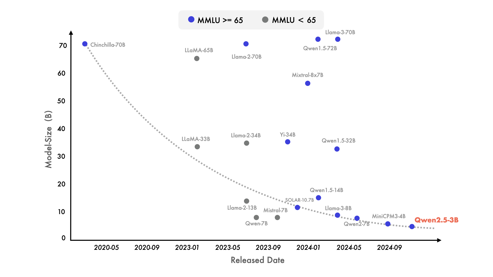

# Robust Temporal Event Reconstruction from Noisy Industrial Logs using Small Language Models under Compute Constraints


## 1. Problem Statement

Industrial systems generate large volumes of unstructured, noisy operational logs (dispatch tickets, incident reports, field technician notes). These logs are:

- temporally inconsistent
- partially missing or duplicated
- written by multiple agents
- unstandardized in format
- often contradictory across updates

Current systems focus on **information extraction (IE)**, but fail to:
- reconstruct correct event timelines
- resolve conflicting updates
- maintain structured consistency across time
- operate reliably under low-resource (CPU-only) constraints


## 2. Research Objective

Design and evaluate a system that converts noisy industrial logs into:

- structured incident records
- temporally consistent event timelines
- optionally, event dependency graphs

under:
- noisy, real-world text conditions
- CPU-only inference constraints
- small LLM usage (≤2B parameters or quantized equivalents)


## 3. Key Research Hypothesis

> Small instruction-tuned LLMs combined with structured decoding and temporal consistency constraints can reconstruct reliable event timelines from noisy industrial logs without requiring large-scale models.


## 4. Recommended Papers to Read

### 4.1 Event Extraction and Temporal Reasoning

1. **Temporal Reasoning in Large Language Models: A Survey (2024)**
   - Focus: temporal inconsistency in LLM outputs
   - Key idea: LLMs struggle with event ordering and causal reasoning

2. **DEEVE: Deep Event Extraction and Event Graph Construction (ACL 2023)**
   - Focus: structured event graphs from unstructured text
   - Key contribution: converting text into event dependency graphs

3. **Log Parsing in the Era of LLMs (2024–2025 surveys in system log mining)**
   - Focus: industrial log structuring
   - Key idea: classical log parsers vs LLM-based extraction


## 5. Research Direction

### 5.1 Core Idea

Move from:

> “Extract structured JSON from logs”

to:

> “Reconstruct temporally consistent incident event graphs from noisy logs”


### 5.2 System Output (Target)

Instead of only JSON:

```json
{
  "incident_summary": "",
  "event_timeline": [
    {
      "timestamp": "",
      "event": "",
      "source": ""
    }
  ],
  "entities": {
    "devices": [],
    "circuits": [],
    "technicians": [],
    "ips": []
  },
  "next_actions": [],
  "conflicts_detected": [],
  "final_resolution": ""
}
````


## 6. Methodology

### 6.1 Baseline Model

Use small instruction-tuned models:

* [**Qwen2.5-1.5B-Instruct**](https://qwen.ai/blog?id=qwen2.5)   --> (*the used model*)
* Phi-3-mini
* Gemma-2B-Instruct

(quantized for CPU inference)




**Figure:** Qwen2.5-3B performance, efficiency and capability compared to its predecessors.


### 6.2 Proposed Enhancements

#### A. Temporal Structuring Layer

* enforce sorted timestamps
* normalize relative time expressions (“later”, “after arrival”)

#### B. Event Consolidation Module

* merge duplicate events across logs
* resolve conflicting updates

#### C. Self-Consistency Decoding

* sample multiple outputs
* select most consistent timeline

#### D. Schema-Constrained Generation

* enforce JSON schema validity
* reject hallucinated fields


## 7. Experimental Design

### 7.1 Dataset Construction

Create synthetic + real hybrid dataset:

* real worklogs (if available)
* synthetic noisy logs with:

  * shuffled timestamps
  * missing events
  * duplicated updates
  * contradictory technician notes


### 7.2 Tasks

1. Event extraction accuracy
2. Temporal ordering accuracy
3. Entity extraction accuracy
4. Conflict detection accuracy
5. JSON validity rate


## 8. Evaluation Framework

### 8.1 Standard Metrics

* Precision / Recall / F1 (entity extraction)
* Sequence alignment score (event ordering)
* ROUGE / BERTScore (summaries)


### 8.2 Temporal Metrics

* **Kendall’s Tau** (ranking agreement of events)
* **Event Order Accuracy (EOA)**
* **Temporal consistency score (custom metric)**


### 8.3 Robustness Metrics

* noise perturbation stress test
* missing field tolerance
* contradiction injection performance


## 9. Baseline Methods

### 9.1 Traditional NLP Baselines

* SpaCy NER + rule-based parser
* Regex-based log parsers
* CRF-based sequence labeling


### 9.2 LLM Baselines

* Direct prompting (Qwen / Phi-3 / Gemma)
* Few-shot prompting
* Chain-of-thought prompting (without constraints)


### 9.3 Recent LLM Techniques (Benchmark Comparison)

* **Structured prompting (JSON schema enforcement)**
* **ReAct-style reasoning (reason + act loops)**
* **Self-consistency decoding**
* **Tool-augmented validation loops**
* **Constrained decoding (grammar-based output control)**


## 10. Proposed Contribution

This research aims to contribute:

1. A temporal reconstruction framework for industrial logs
2. A lightweight LLM-based event graph reconstruction pipeline
3. A robustness evaluation benchmark for noisy dispatch logs
4. A CPU-efficient inference approach for constrained environments


## 11. Expected Outcome

* Demonstrate that small LLMs can perform near-large-model-level extraction when combined with:

  * temporal constraints
  * structured decoding
  * consistency filtering

* Identify failure modes of LLMs in:

  * time reasoning
  * event merging
  * conflict resolution


## 12. Compute Constraints

* CPU-only inference (4 cores)
* Quantized models (GGUF Q4/Q5)
* No dependency on large-scale GPU training
* Optional LoRA fine-tuning on small dataset


## 13. Timeline

| Phase    | Task                             |
| -- | -- |
| Week 1–2 | Dataset creation + preprocessing |
| Week 3   | Baseline model implementation    |
| Week 4–5 | Temporal reconstruction module   |
| Week 6   | Evaluation + benchmarking        |
| Week 7   | Ablation studies                 |
| Week 8   | Paper writing                    |


## 14. Final Note

The novelty of this research does not come from using LLMs for extraction, but from:

> enforcing temporal consistency and structured reasoning under noise and resource constraints
